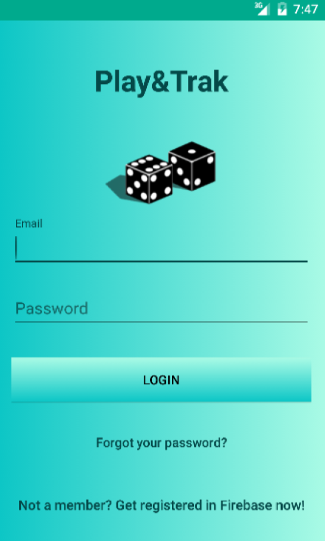
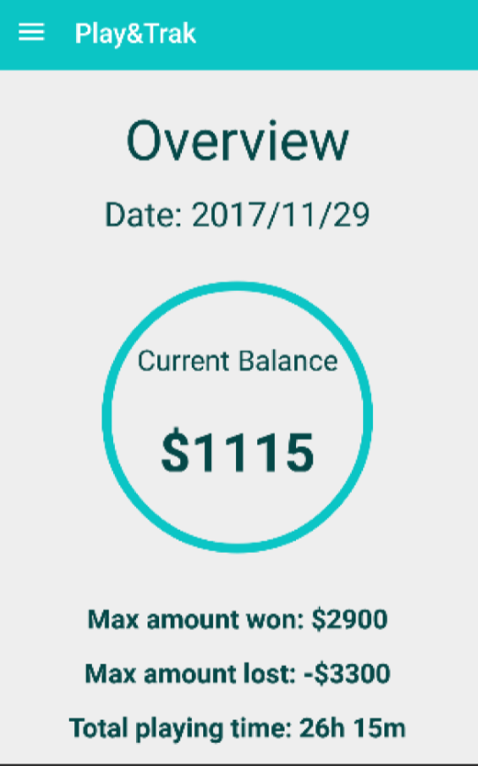
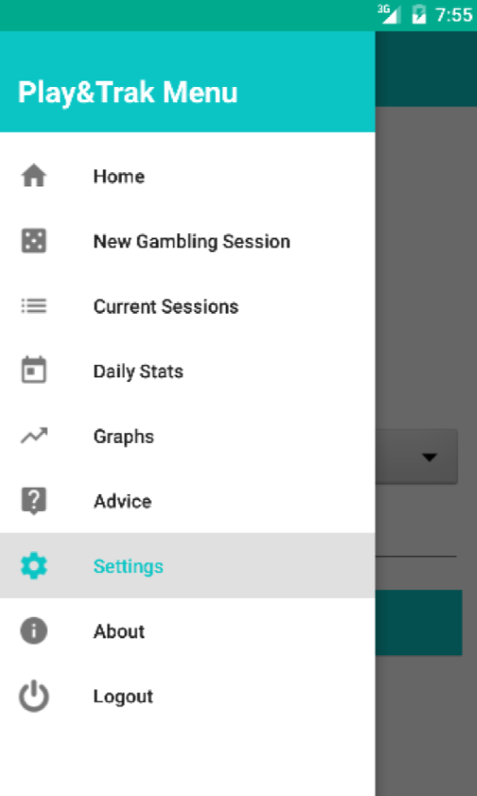
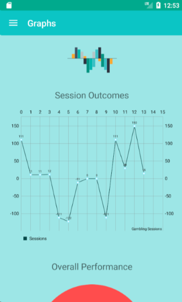
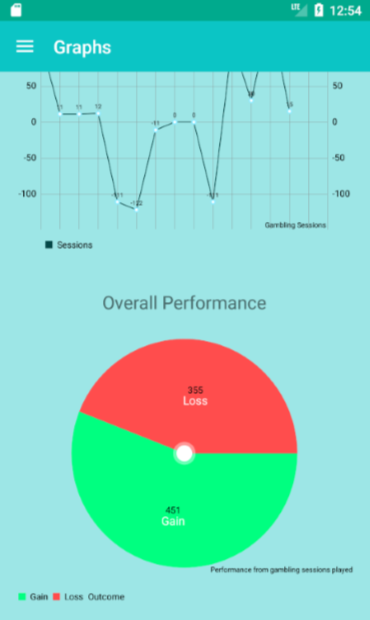
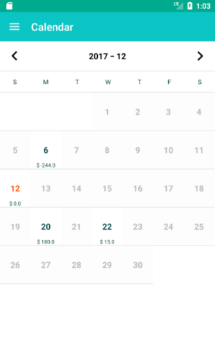
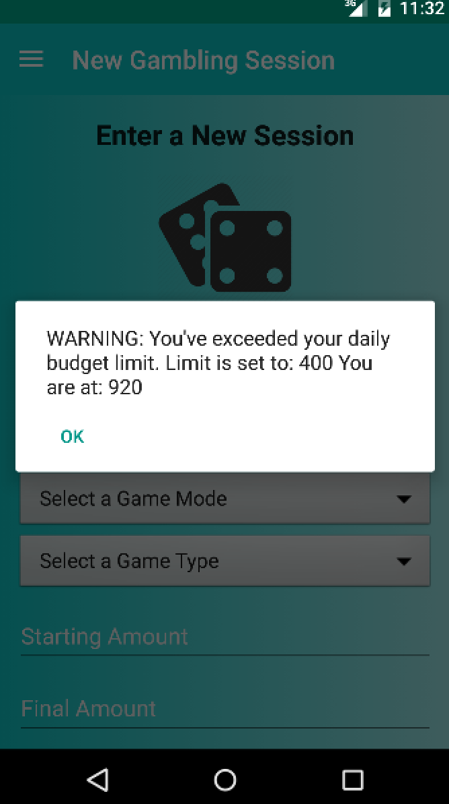
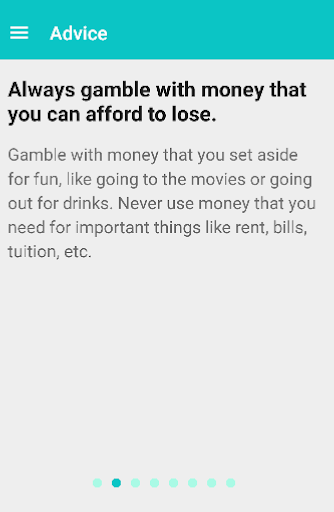

# Self-MonitoringGamblingApp
Android application to keep track of gambling activities for excessive players, and reduce the gambling behavior.

There is a big concern among casino games, lottery, excessive gambling, and with the
expansion of online gambling making these activities much more accessible, we can
notice a considerable increase of the gambling activities among young players which in
the end may result in very positive results for the business, but negatively for the
gambler, who may suffer many negative consequences (e.g.,addiction, ruin). The
gambling monitoring project consists of developing a smartphone application targeting
the gambling activities of young players, notably college students, and giving them the
means to control their gambling behavior. Research shows that up to 80% of college
students gamble or already have, and a significant number develop gambling-related
problems. Hence, if a player develops excessive gambling behavior such as playing for
an excessive amount of time or losing an unreasonable amount of money while playing,
the application should identify this pattern and notify the player of his behaviours giving
him some recommendations where applicable.

The desired goal of this app is to help players monitor their gambling behaviour and
perhaps help reduce it if over-involvement in gambling activities has occurred. The application
displays the duration of the gambling session, and tracks the amount of money won/lost per
session.

## Login & Overview
   

Ideally, through the use of this application, players will recognize over-involvement and
modify their gambling behaviour. The notification system will also act as an alert when a certain
type of behaviour has happened: behaviors can consist of going over a spending or duration limit, to
getting gambling feedback based on previous sessions.

## Progression
       

Visual representation of a user’s sessions and outcomes.

## Games
     

All the gambling sessions submitted by the user are
displayed. It shows the most important
information about each session such as the date, the game type, the duration and the outcome.
